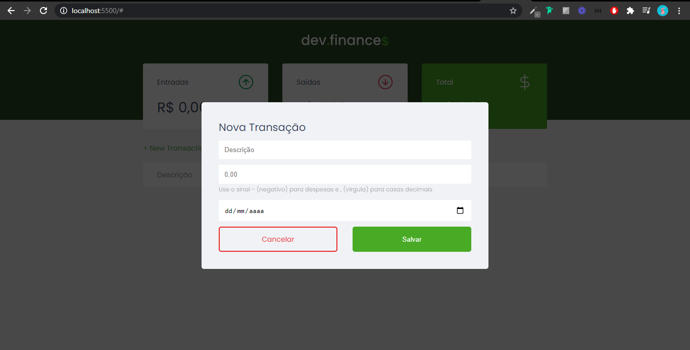

<h1
  align="center"
>
  
</h1>

### Application Web developed at [Rocketseat Discover Marathon](https://maratonadiscover.rocketseat.com.br/inscricao) by [Mayk Brito](https://github.com/maykbrito). The application was developed with HTML5, CSS3 and JS Vanilla. But still subject to some changes.

 
<h3
  align="center"
>
  
</h3>

 

## LAYOUT

 
If you are interested in accessing the original example layout of the application created by Rocketseat you can click on this [Link](https://www.figma.com/file/7Vu9DzUaCZIV4nibzkjgB4/dev.finance-Maratona-Discover/duplicate)

 

## PROJECT DEVELOPMENT

 

### First Class - The basis of everything

 

#### Concepts covered

- Soft Skills and what it is to be a programmer, market opportunities and study methods.
- Hard Skills, we saw the whole base of the HTML structure and semantic tags
- CSS, we learned how the Box Model works, how to deal with fonts and colors within a page
- Selectors, types of values ​​and identifiers such as ID and Class

#### Development

- Application structure with HTML
- CSS styling

  

### Second Class - Finalization of HTML + CSS

#### Concepts covered

- Images
- Accessibility
- Layout of elements on the page
- Responsiveness
- Form for data registration
- Modal
- A pinch of JavaScript

#### Development

- Finalization application structure with HTML
- Finalization CSS styling

  

### Third Class - Adding JavaScript

#### Concepts covered

- Objects
- Data types and structure
- If / else
- Errors
- Functionalities
- Add and remove transactions
- Calculate
- Save to localStorage

 

## TECHNOLOGIES

  
    
  &nbsp;
  
    
  &nbsp;
  
    
  &nbsp;
  
    
  &nbsp;
  
    
  

 <br/ 

## SCREENS

 

  
    

  

 
 

## ABOUT ME
